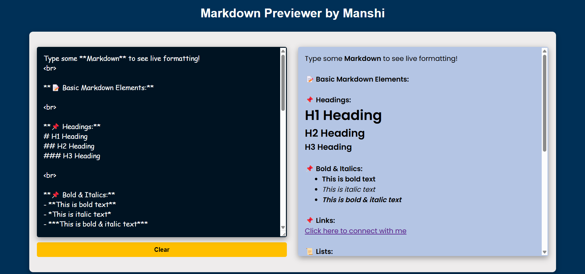

# Markdown Previewer  

A web application that allows users to write and preview **Markdown** in real time. It supports all standard Markdown elements using the `marked.js` library.  

## Live Demo  
[View the Deployed App](https://markdown-previewer-by-manshi.netlify.app/) 

## Features  
✔️ Live **Markdown to HTML** conversion  
✔️ Supports **all Markdown elements**, including:  
   - Headings (`#`, `##`, `###`, etc.)  
   - Bold & Italics (`**bold**`, `*italic*`, `~~strikethrough~~`)  
   - Blockquotes (`> Quote`)  
   - Links (`[text](https://example.com)`)  
   - Lists (ordered & unordered)  
   - Tables  
   - Inline & multi-line code blocks with syntax highlighting  
   - Horizontal rules (`---`)
 
✔️ Clear button to reset input instantly  
✔️ Fully responsive for **desktop and mobile**  

## Screenshot  

 

## Tech Stack  
- **Frontend:** HTML, CSS, JavaScript  
- **Libraries:** Marked.js (Markdown Parsing), Highlight.js (Syntax Highlighting)  

## Usage  
1. Type **Markdown** text in the editor (left side).  
2. The **preview** (right side) updates in real time.  
3. Click **Clear** to reset the editor.  
4. Use **triple backticks** (\`\`\`) for multi-line code blocks.  
